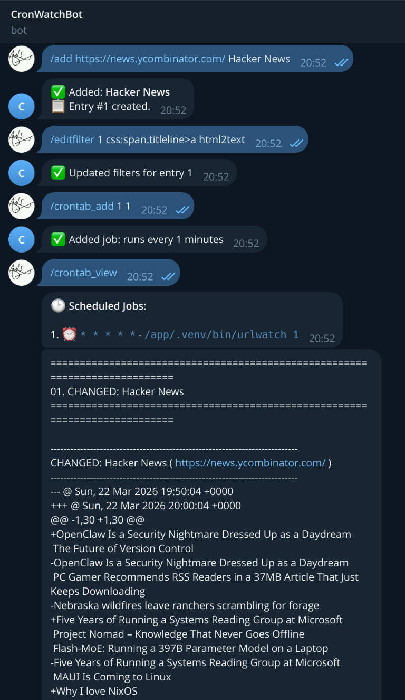

# CronWatchBot

[](https://github.com/AnkS4/CronWatchBot/actions/workflows/test.yml)
[](https://www.python.org/downloads/)
[](https://github.com/astral-sh/ruff)
[](LICENSE)

A Telegram bot for managing and monitoring URLWatch jobs with automated scheduling via cron. Monitor websites for changes and receive instant Telegram notifications - all controlled through simple chat commands.

## Features

- 🔍 **URL Monitoring** - Track website changes with URLWatch
- 📱 **Telegram Integration** - Manage everything via Telegram chat
- ⏰ **Automated Scheduling** - Set up cron jobs to run checks automatically
- 🔐 **Secure Access** - User ID-based authentication
- 🐳 **Docker Ready** - Production-ready containerized deployment
- 💾 **Data Persistence** - Docker volumes for configuration and cron jobs
- 🛡️ **Security Hardened** - Non-root user, resource limits

### 🎬 Bot Demo

<p align="center">
  
</p>

*Key features demonstrated: URL monitoring with `/add`, content filtering with `/editfilter`, automated scheduling with `/crontab_add`, job management with `/crontab_view`, and received notification*

---

## Table of Contents

- [File Structure](#file-structure)
- [Installation](#installation)
- [Bot Commands](#bot-commands)
- [Data Persistence](#data-persistence)
- [Troubleshooting](#troubleshooting)
- [Architecture](#architecture)
- [Security](#security)

---

## File Structure

```
📁 CronWatchBot/
├── 📁 config/                    # Bot configuration and logging
│   ├── config.py                 # Environment variable loading
│   └── logging.py                # Logging setup & HTTP filter
├── 📁 docker/                    # Docker configuration
│   ├── Dockerfile                # Multi-stage build
│   ├── docker-compose.yml        # Orchestration with volumes
│   └── entrypoint.sh             # Container initialization
├── 📁 handlers/                  # Telegram command handlers
│   ├── basic.py                  # /start, /help
│   ├── crontab_manage.py         # /crontab_* commands
│   ├── shared.py                 # Auth & error handling
│   └── urlwatch_manage.py        # /add, /list, /delete, /edit* commands
├── 📁 helpers/                   # Core business logic
│   ├── crontab_helpers.py        # Crontab operations
│   └── urlwatch_helpers.py       # URLWatch file operations
├── 📁 utils/                     # Utility modules
│   ├── __init__.py               # Package exports
│   └── escape.py                 # HTML escaping for Telegram
├── � .env.example               # Environment variables template
├── 📜 LICENSE                    # MIT License
├── 🐍 main.py                    # Bot entry point
├── 📄 pyproject.toml             # Python dependencies (uv)
├── 📄 README.md                  # Documentation
└── � uv.lock                    # Locked dependency versions
```

---

## Installation

### Method 1: Docker Compose (Recommended)

**Prerequisites:**
- Docker and Docker Compose installed
- Telegram bot token from [@BotFather](https://t.me/botfather)
- Your Telegram user ID from [@userinfobot](https://t.me/userinfobot)

**Setup:**

```bash
# Clone the repository
git clone https://github.com/AnkS4/CronWatchBot
cd CronWatchBot

# Configure environment
cp .env.example .env
nano .env  # Add your bot token and user ID

# Start the application
docker compose -f docker/docker-compose.yml up -d

# Follow logs
docker compose -f docker/docker-compose.yml logs -f
```

That's it! Send `/start` to your bot on Telegram.

**Management commands:**

```bash
# Force build and start
docker compose -f docker/docker-compose.yml up --build -d

# View logs
docker compose -f docker/docker-compose.yml logs -f

# Stop
docker compose -f docker/docker-compose.yml down

# Restart
docker compose -f docker/docker-compose.yml restart
```

### Method 2: Manual Docker Build

**Prerequisites:**
- Docker installed
- Telegram bot token from [@BotFather](https://t.me/botfather)
- Your Telegram user ID from [@userinfobot](https://t.me/userinfobot)

**Setup:**

```bash
# Clone the repository
git clone https://github.com/AnkS4/CronWatchBot
cd CronWatchBot

# Configure environment
cp .env.example .env
nano .env  # Add your bot token and user ID

# Build the image
docker build -f docker/Dockerfile -t cronwatchbot:latest .

# Start the application with volumes
docker run -d \
  --name cronwatchbot \
  --env-file .env \
  --restart unless-stopped \
  -v cronwatchbot-urlwatch:/home/cronwatchbot/.config/urlwatch \
  -v cronwatchbot-crontab:/var/spool/cron/crontabs \
  cronwatchbot:latest
```

**Management commands:**
```bash
# View logs
docker logs -f cronwatchbot

# Stop
docker stop cronwatchbot

# Restart
docker restart cronwatchbot

# Remove
docker rm -f cronwatchbot
```

### Method 3: Manual Installation (Not Recommended)

**Prerequisites:**
- Python 3.14+
- URLWatch installed
- Cron service enabled
- uv package manager
- Telegram bot token from [@BotFather](https://t.me/botfather)
- Your Telegram user ID from [@userinfobot](https://t.me/userinfobot)

**Setup:**

```bash
# Clone the repository
git clone https://github.com/AnkS4/CronWatchBot
cd CronWatchBot

# Configure environment
cp .env.example .env
nano .env  # Add your bot token and user ID
uv sync

# Configure URLWatch
mkdir -p ~/.config/urlwatch
nano ~/.config/urlwatch/urlwatch.yaml
```

Add Telegram reporter:
```yaml
report:
  telegram:
    bot_token: 'your_bot_token_here'
    chat_id: 'your_user_id_here'
    enabled: true
```

### Start the application
```bash
uv run python main.py
```

---

## Bot Commands

### URL Management

- `/add <url> <name>` - Add a URL to monitor
- `/list` - View all monitored URLs
- `/delete <index>` - Remove a URL
- `/editfilter <index> <filter>` - Add CSS/XPath filter and transformations
- `/editprop <index> <property>` - Edit URL properties

### Cron Job Management

- `/crontab_add <url_index> <minutes>` - Schedule automated monitoring
- `/crontab_view` - View all scheduled jobs
- `/crontab_edit <job_index> <minutes>` - Update schedule
- `/crontab_delete <job_index>` - Remove schedule

### Example Workflow

```
# 1. Add Hacker News to monitoring
/add https://news.ycombinator.com/ Hacker News

# 2. Filter to only track story titles
/editfilter 1 css:span.titleline>a html2text

# 3. Schedule to check every 3 hours (180 minutes)
/crontab_add 1 180

# 4. View scheduled jobs
/crontab_view
```

You'll now receive Telegram notifications every 3 hours when Hacker News front page changes!

---

## Data Persistence

### Docker Volumes

All data is stored in Docker volumes:

- **`urlwatch-data`** - URLWatch configuration, monitored URLs, and cache
- **`crontab-data`** - Scheduled cron jobs

**Data persists automatically** across container restarts:
```bash
# Stop container
docker compose -f docker/docker-compose.yml down

# Start container - all data restored automatically
docker compose -f docker/docker-compose.yml up -d
```

**Export URLs for safekeeping** (optional):
```bash
# Export your URL list (no secrets)
docker exec cronwatchbot cat /home/cronwatchbot/.config/urlwatch/urls.yaml > urls-backup.yaml

# Import later by copying back
docker cp urls-backup.yaml cronwatchbot:/home/cronwatchbot/.config/urlwatch/urls.yaml
```

### Volume Management

```bash
# List volumes
docker volume ls | grep cronwatchbot

# Inspect volume
docker volume inspect docker_urlwatch-data

# Remove volumes (⚠️ deletes all data)
docker compose -f docker/docker-compose.yml down -v
```

### Health Monitoring

**Check container health:**
```bash
# Manual check
docker inspect cronwatchbot --format='{{.State.Health.Status}}'

# Continuous monitoring
watch -n 30 'docker inspect cronwatchbot --format="{{.State.Health.Status}}"'
```

**Monitor resource usage:**
```bash
docker stats cronwatchbot
```

## Troubleshooting

### Bot Not Responding

**Check container status:**
```bash
docker ps -a | grep cronwatchbot
```

**View logs:**
```bash
docker compose -f docker/docker-compose.yml logs --tail 100
```

**Common fixes:**
- Verify `TELEGRAM_BOT_TOKEN` and `ALLOWED_USER_IDS` in `.env`
- Ensure your user ID is correct (get it from [@userinfobot](https://t.me/userinfobot))
- Restart: `docker compose -f docker/docker-compose.yml restart`

### No Notifications from URLWatch

**Check URLWatch config inside container:**
```bash
docker exec cronwatchbot cat /home/cronwatchbot/.config/urlwatch/urlwatch.yaml
```

Ensure `enabled: true` under `report.telegram`.

**Test manually:**
```bash
docker exec cronwatchbot su-exec cronwatchbot urlwatch 1
```

### Cron Jobs Not Executing

**Check if crond is running:**
```bash
docker exec cronwatchbot ps aux | grep crond
```

**View crontab entries:**
```bash
docker exec cronwatchbot crontab -l -u cronwatchbot
```

**Check cron execution in logs:**
```bash
docker compose -f docker/docker-compose.yml logs | grep urlwatch
```

### Permission Issues

**Check file ownership:**
```bash
docker exec cronwatchbot ls -la /home/cronwatchbot/.config/urlwatch
```

**Check crontab permissions:**
```bash
docker exec cronwatchbot ls -la /var/spool/cron/crontabs/
```

### Duplicate Cron Jobs

The bot prevents adding duplicate jobs. If you try to add a job for a URL that already has one:

```
⚠️ A cron job already exists for URL #1.
Use /crontab_edit 1 <minutes> to update the schedule.
```

### Resource Usage

**Monitor container resources:**
```bash
docker stats cronwatchbot
```

**Default limits:**
- CPU: 0.5 cores max, 0.1 cores reserved
- Memory: 256MB max, 64MB reserved

Adjust in `docker/docker-compose.yml` if needed.

### Health Check

**Check container health:**
```bash
docker inspect cronwatchbot --format='{{.State.Health.Status}}'
```

Should return `healthy`. If `unhealthy`, check logs for errors.

---

## Architecture

### Container Architecture

**Base Image:** `python:3.14-alpine3.23`
- Minimal Alpine Linux with BusyBox utilities
- Multi-stage build for smaller image size
- `uv` for fast Python dependency installation

**Process Structure:**
```
PID 1: entrypoint.sh (root)
  ├─ crond -f (root) - Required for BusyBox to execute user crontabs
  └─ python main.py (cronwatchbot) - Bot process as non-root user
```

**Why crond runs as root:**
BusyBox crond requires root privileges to read `/var/spool/cron/crontabs/<user>` files. The bot process itself runs as the non-root `cronwatchbot` user (UID 1000) for security.

**Data Directories:**
- `/home/cronwatchbot/.config/urlwatch` - URLWatch config and cache (owned by cronwatchbot)
- `/var/spool/cron/crontabs` - Crontab files (owned by root, individual files by users)
- `/app` - Application code (owned by cronwatchbot)
- `/usr/local/bin/urlwatch` - Symlink to `/app/.venv/bin/urlwatch` for clean cron commands

**Crontab Persistence:**
- **Startup Reload**: Bot automatically reloads existing crontab entries on startup
- **CronTab(user=True)**: Uses `crontab` command internally to signal crond after changes
- **Volume Persistence**: Crontab data persists across container restarts via Docker volumes

**Project Structure:**
- **config/** - Configuration and logging setup
- **handlers/** - Telegram command handlers (`/start`, `/help`, `/add`, `/crontab_*`, etc.)
- **helpers/** - Core business logic (crontab operations, URLWatch file management)
- **utils/** - Utility modules (HTML escaping for Telegram messages)
- **docker/** - Docker configuration (Dockerfile, docker-compose.yml, entrypoint.sh)
- **main.py** - Bot entry point, command registration, and crontab reload on startup

**Code Quality:**
- **PEP 8 Imports**: Organized by standard library, third-party, and local modules
- **Type Hints**: Full type annotations for better IDE support and error detection
- **No Unused Imports**: All imports are actively used in the codebase
- **Minimal Dependencies**: Only essential packages included

---

## Security

### Authentication & Authorization
- **User ID Whitelist**: Only Telegram user IDs in `ALLOWED_USER_IDS` can use the bot
- **No Public Access**: Bot rejects all unauthorized users
- **Rate Limiting**: 2 commands per second per user to prevent flooding
- **Token Storage**: Bot token stored in environment variables and written to `urlwatch.yaml` (see [Token Security Considerations](#token-security-considerations))

### Container Security

**Process Isolation:**
- **Non-root User**: Bot process runs as `cronwatchbot` (UID 1000)
- **Minimal Base**: Alpine Linux reduces attack surface
- **SUID Binary**: Only `crontab` binary has SUID for user cron management

**Filesystem Security:**
- **Read-only Filesystem**: Application code mounted read-only
- **Tmpfs Mounts**: `/tmp` mounted with `noexec,nosuid` flags
- **File Permissions**: Config files restricted to 600, Python files to 644
- **Write Access**: Only `/home/cronwatchbot/.config/urlwatch` and `/var/spool/cron` writable

**Capability Management:**
- **Capability Dropping**: All capabilities dropped, only 5 essential ones added
- **Minimal Permissions**: SETUID, SETGID, CHOWN, FOWNER, DAC_OVERRIDE
- **Purpose**: Each capability serves specific security/operational needs
- **DAC_OVERRIDE**: Required for crontab command permission bypass

**Resource Limits:**
- **CPU**: 0.5 cores max, 0.1 cores reserved
- **Memory**: 256MB max, 64MB reserved
- **Adjustable**: Configure in `docker-compose.yml` as needed

**Automated Security:**
- **Daily Scanning**: Trivy scans for vulnerabilities every day at 02:00 UTC
- **GitHub Security**: SARIF results uploaded to Security tab
- **Fail on Critical**: Build fails on CRITICAL/HIGH fixable vulnerabilities
- **Manual Triggers**: Can run scans on-demand via GitHub Actions

### Input Validation
- **Command Injection Protection**: All job indices and parameters validated
- **Reserved Field Protection**: Critical fields (url, name, filter) protected
- **Index Validation**: Strict bounds checking on all array access
- **Atomic File Operations**: Prevents data corruption during concurrent writes

### Token Security Considerations

**Known Limitation:** The Telegram bot token is written to `/home/cronwatchbot/.config/urlwatch/urlwatch.yaml` because urlwatch does not support environment variable interpolation in its configuration files.

**Mitigations in place:**
- ✅ File permissions set to `600` (owner read/write only)
- ✅ File owned by non-root `cronwatchbot` user (UID 1000)
- ✅ Volume access restricted to container
- ✅ Container isolation limits exposure

**Additional security recommendations:**
- 🔒 Use Docker volume encryption if available on your platform
- 🔒 Restrict host access to Docker volumes directory
- 🔒 Use Telegram bot token rotation periodically via [@BotFather](https://t.me/botfather)
- 🔒 Monitor bot activity for unauthorized usage
- 🔒 Avoid mounting volumes to untrusted locations

**Trade-off:** This is an architectural limitation of urlwatch. The token must be on disk for urlwatch to send notifications. The file permissions and container isolation provide reasonable protection for most use cases.

### Best Practices
- ✅ Never commit `.env` file (automatically gitignored)
- ✅ Limit `ALLOWED_USER_IDS` to trusted users only
- ✅ Monitor container logs for suspicious activity
- ✅ Rotate bot token periodically
- ✅ Export `urls.yaml` periodically for safekeeping
- ✅ Verify security hardening with provided commands

---

## Environment Variables

Required variables in `.env`:

| Variable | Description | Example |
|----------|-------------|----------|
| `TELEGRAM_BOT_TOKEN` | Bot token from [@BotFather](https://t.me/botfather) | `123456789:ABCdef...` |
| `ALLOWED_USER_IDS` | Comma-separated Telegram user IDs | `123456789,987654321` |

**Get your user ID:** Send a message to [@userinfobot](https://t.me/userinfobot)

---

## Development

### Setup

```bash
# Clone repository
git clone https://github.com/AnkS4/CronWatchBot && cd CronWatchBot

# Install dependencies (includes dev tools)
uv sync

# Configure environment
cp .env.example .env
nano .env  # Add your TELEGRAM_BOT_TOKEN and ALLOWED_USER_IDS
```

### Running Locally

```bash
# Start the bot
uv run python main.py

# Or with auto-reload during development (requires watchdog)
# uv add --dev watchdog
# uv run watchmedo auto-restart -d . -p '*.py' -- python main.py
```

### Testing

```bash
# Run all tests with coverage
uv run pytest

# Run specific test file (without coverage threshold)
uv run pytest tests/unit/test_config.py --no-cov

# Run with verbose output
uv run pytest -v

# Generate HTML coverage report
uv run pytest --cov-report=html
# Open htmlcov/index.html in browser
```

### Code Quality

```bash
# Lint (check for issues)
uv run ruff check .

# Format code
uv run ruff format .

# Type checking
uv run mypy .

# Run all checks (lint + format + type check)
uv run ruff check . && uv run ruff format --check . && uv run mypy .
```

---

## License

MIT License - see [LICENSE](LICENSE) file for details.

---

## Acknowledgments

- [URLWatch](https://github.com/thp/urlwatch) - Website change detection
- [python-telegram-bot](https://github.com/python-telegram-bot/python-telegram-bot) - Telegram Bot API wrapper
- [uv](https://github.com/astral-sh/uv) - Fast Python package installer
